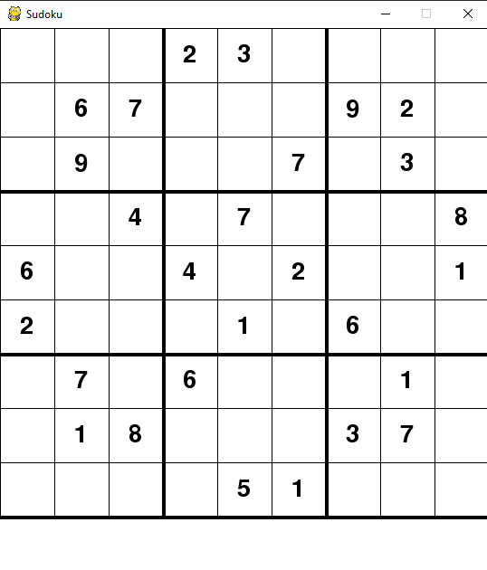

# Description

The application is used to scan sudoku board with CNN and solve it using library **py-sudoku**. The project was developed with help of https://www.pyimagesearch.com/2020/08/10/opencv-sudoku-solver-and-ocr/ tutorial. 

# Using
1. Firstly create folder, open it in IDE or text editor and clone reposytory (or download zip) 
> git clone https://github.com/vovaklh/Sudoku_solver_using_CNN_with_GUI.git
2. Secondly install needed libraries 
> pip install -r requirements.txt
3. Run this command in terminal
> python interface.py -i (path_to_image) -m (path_to_model)
4. If board is correct, press **r** to get solution
5. Otherwise board is incorrect, select cell and enter right digit
6. When you get solution select any cell to get part of sollution
7. Press **s** to display full sollution
